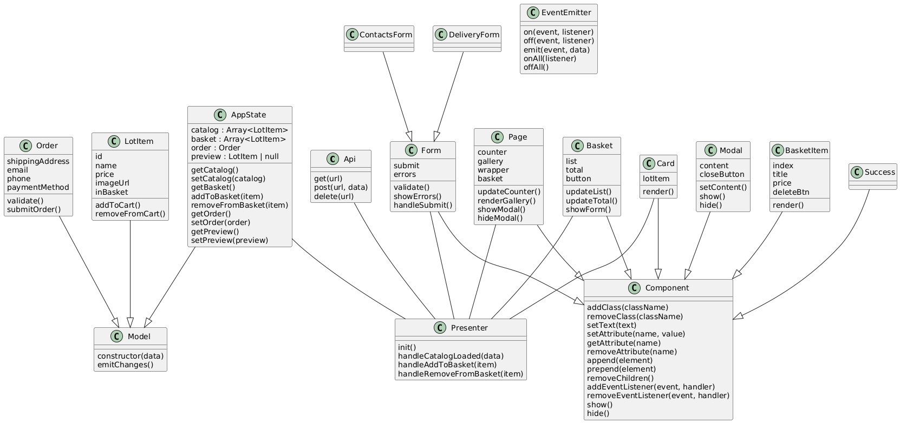

# 3й курс
# Ельцов Кирилл Павлович
# Проектная работа "Веб-ларек"

Стек: HTML, SCSS, TS, Webpack

Структура проекта:
- src/ — исходные файлы проекта
- src/components/ — папка с JS компонентами
- src/components/base/ — папка с базовым кодом

Важные файлы:
- src/pages/index.html — HTML-файл главной страницы
- src/types/index.ts — файл с типами
- src/index.ts — точка входа приложения
- src/scss/styles.scss — корневой файл стилей
- src/utils/constants.ts — файл с константами
- src/utils/utils.ts — файл с утилитами

## Установка и запуск
Для установки и запуска проекта необходимо выполнить команды

```
npm install
npm run start
```

или

```
yarn
yarn start
```
## Сборка

```
npm run build
```

или

```
yarn build
```
## Архитектура
Приложение будет реализовано по MVP архитектуре
## Uml схема

## Базовый код
### 1.Класс 'Api'
Обеспечивает доступ к веб-серверу. Реализует 2 типа основных операций: безопасные (GET) и небезопасные (POST, DELETE)
### 2.Класс 'Components'
Базовый класс для всех компонентов View. Реализует базовые элементы работы с элементами, такие как переключение классов, установка текста у элемента, управление атрибутами, добавление и удаление дочерних элементов, обработку событий.
### 3.Класс 'EventEmitter'
Позволяет подписываться на события и уведомлять подписчиков.
Класс иметт методы **on, off, emit, onAll, offAll** для подписки, отписки и уведомления о событии.
### 4.Класс 'Model'
Базовый класс для компонентов Model. Связывает данные со свойствами объекта с помощью метода **constructor** и позволяет генерировать события об изменениях метод **emitChanges**.

## Компоненты модели данных
### 1.Класс 'AppState'
Хранит состояние всего приложения
Свойства:
1. `catalog` Список доступных лотов.
2. `basket` Список лотов в корзине.
3. `order` Текущий заказ.
4. `preview` Лот для предпросмотра.
   События:  `catalog:changed`, `basket:updated`, `order:changed`, `preview:changed`.
### 2.Класс 'LotItem'
Представляет отдельный товар
Свойства:
1. `id`
2. `name`
3. `price`
4. `imageUrl`
5. `inBasket`
   Событие: `lot:changed`
### 3. Класс 'Order'
Представляет данные во время оформления заказа и имеет следующие
Свойства: `shippingAddress`, `email`, `phone`, `paymentMethod`.
Событие: `formErrors:changed`

## Компоненты представления
### 1. Класс 'Page'
Представление страницы
1. `counter` количество товара
2. `gallery` доступные карточки
3. `wrapper` обертка для блокировки прокрутки
4. `basket` кнопка отображения корзины
   Событие `basket:open`
### 2. Класс 'Modal'
Представление модального окна
Свойства:
1. `content` содержание модального окна
2. `closeButton` кнопка закрытия модального окна
   Событие `modal:close`
### 3. Класс 'Basket'
Представление корзины
Свойства:
1. `list` список товаров корзины
2. `total` общая стоимость корзины
3. `button` кнопка оформления окна заказа
   Событие: `order_payment:open`
### 4. Класс 'Card'
Представление карточки товара
Свойство: `lotItem` представляет данные о товаре
Событие: `card:click`
### 5. Класс 'BasketItem'
Представление элемента в корзине
Свойства:
1. `index` номер товара в корзине
2. `title` название товара в корзине
3. `price` стоимость товара в корзине
4. `deleteBtn` кнопка удаления товара из корзины
   Событие: `basketItem:removed`
### 6. Класс 'Form'
Базовый класс для форм
Свойства:
1. `submit` кнопка отправки формы
2. `errors` отображение ошибок формы
### 7. Класс 'ContactsForm'
Наследуется от класса Form. Нужен для отображения формы оформления заказа с контактной информацией.
Свойства:
1. `phone` телефон
2. `email` почта
### 8. Класс 'DeliveryForm'
Наследуется от класса Form. Нужен для отображения формы оформления заказа с адресом доставки и методом оплаты.
Свойства:
1. `address` адрес доставки
2. `payment` способ оплаты
### 9. Класс 'Success'
Основаня информция об оформленном заказе
Свойство: `total` итоговая стоимость заказа