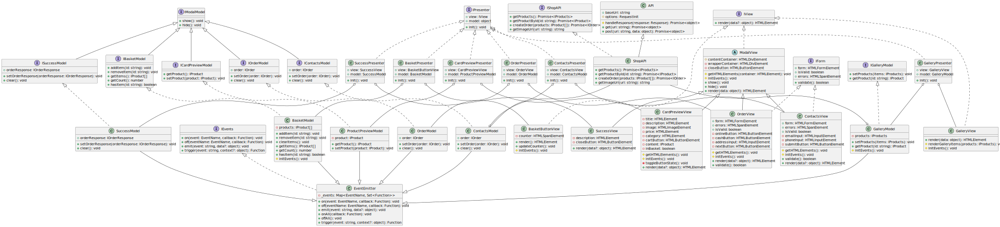

# 3 курс

# Рукавишников Александр Сергеевич

# Проектная работа "Веб-ларек"

Стек: HTML, SCSS, TS, Webpack

Структура проекта:

- src/ — исходные файлы проекта
- src/components/ — папка с JS компонентами
- src/components/base/ — папка с базовым кодом

Важные файлы:

- src/pages/index.html — HTML-файл главной страницы
- src/types/index.ts — файл с типами
- src/index.ts — точка входа приложения
- src/scss/styles.scss — корневой файл стилей
- src/utils/constants.ts — файл с константами
- src/utils/utils.ts — файл с утилитами

## Установка и запуск

Для установки и запуска проекта необходимо выполнить команды

```bash
yarn
yarn start
```

## Сборка

```bash
yarn build
```

## Архитектура проекта

Используется паттерн проектирования MVP.

### UML

#### Простая UML диаграмма


#### Полная UML диаграмма



### Описание структуры базового кода, компонентов и моделей данных:

- **Базовый код**: включает в себя общие интерфейсы и классы.
- **Компоненты**: реализуют функциональность приложения.
- **Модели данных**: представляют собой классы, управляющие состоянием данных.

### Базовый код

- **EventEmitter** - класс для управления событиями. Позволяет подписываться на события и вызывать их.
- **utils** - набор полезных функций. Позволяет проще работать с DOM элементами.
- **api** - класс для работы с API. Позволяет вызывать методы get и post.

### Базовые интерфейсы

- **IView** - интерфейс для работы с представлениями.
- **IPresenter** - интерфейс презентера.
- **IEvents** - интерфейс для управления событиями.
- **IShopAPI** - интерфейс для работы с API магазина.
- **IProduct** - интерфейс для работы с товарами.
- **IForm** - интерфейс для работы с формами.

### Интерфейсы компонентов

- **IModalModel** - интерфейс модели данных модальных окон.
- **IGalleryModel** - интерфейс модели данных галереи.
- **IContactsModel** - интерфейс модели данных контактов.
- **IOrderModel** - интерфейс модели данных заказа.
- **ISuccessModel** - интерфейс модели данных успешной покупки.

### Модели данных

- **BasketModel** - модель данных корзины. Позволяет добавлять, удалять товары, получать их общее количество и стоимость.
- **ModalModel** - абстрактная модель данных модальных окон. Позволяет открывать и закрывать модальные окна.
- **GalleryModel** - модель данных галереи. Позволяет изменять состояние галереи.
- **ContactsModel** - модель данных контактов. Позволяет изменять состояние модального окна контактов.
- **OrderModel** - модель данных заказа. Позволяет изменять состояние модального окна заказа.
- **SuccessModel** - модель данных успешной покупки. Позволяет изменять состояние модального окна успешной покупки.

### Представления

- **GalleryView** - представление галереи.
- **BasketButtonView** - представление кнопки корзины.
- **CardPreviewView** - представление модального окна карточки товара.
- **OrderView** - представление модального окна заказа.
- **ContactsView** - представление модального окна контактов.
- **SuccessView** - представление модального окна успешной покупки.

### Презентеры

- **GalleryPresenter** - презентер галереи.
- **BasketPresenter** - презентер корзины.
- **CardPreviewPresenter** - презентер карточки товара.
- **OrderPresenter** - презентер заказа.
- **ContactsPresenter** - презентер контактов.
- **SuccessPresenter** - презентер успешной покупки.
